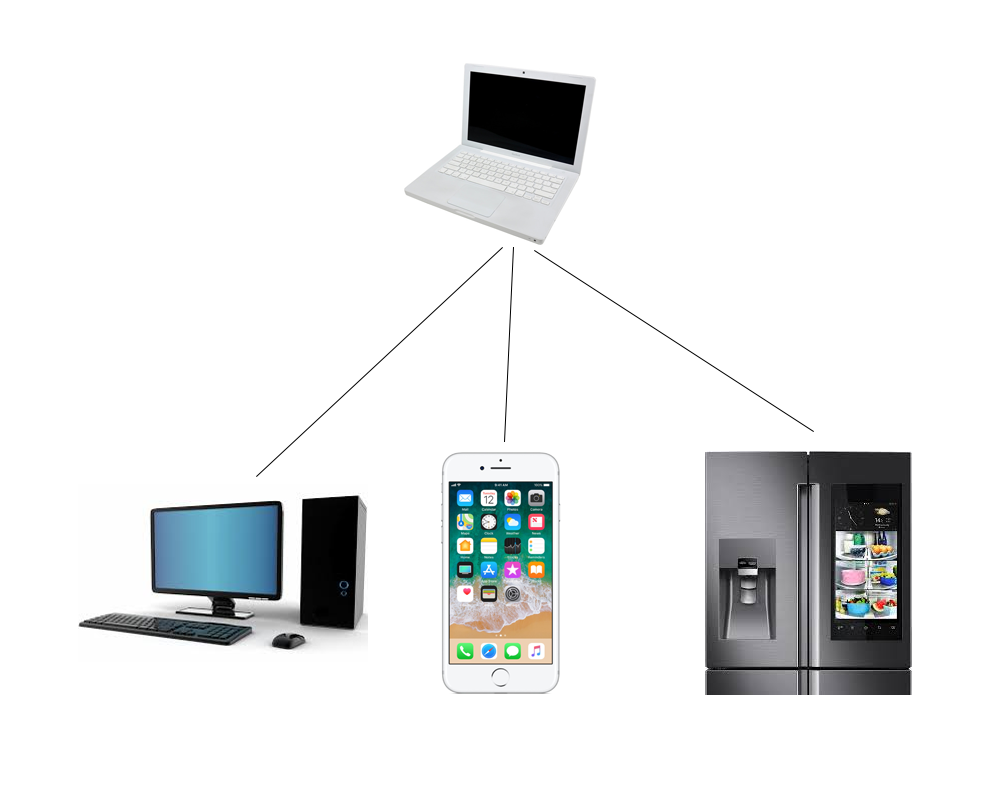

#Software Design Project Proposal#

##Basic Info##
1. Team Name: The Good Guys
2. Team Members:
    * Tyler Simmons, Email: tug13474@temple.edu
    * Jesse Dewald, Email: tuf43007@temple.edu
3. Git url: https://tylersimmonsTU@bitbucket.org/tylersimmonsTU/cis3296project.git

##Description##

1. *What is the problem?*
Security is a concern for all forms of peer-to-peer text-based communication. There are many cases where individuals may want to ensure that their communications are kept private, but appropriate solutions may not exist. There are services which provide for chat with end-to-end encryption, but there are often closed-source and rely on the trustworthiness of unknown third parties. Another option would be to communicate via a private web server, but the user may lack the means or technical know-how to ensure that communications are securely transmitted.
2. *Why is the problem important?*
Encrypted communication is useful to everyone who values privacy. Individuals who transmit particularly sensitive information may find other solutions lacking for the reasons stated above. Because privacy and security needs vary, it is important to address the concerns of those who may have more stringent requirements for a communication platform.
3. *What is our solution?*
Our solution avoids the pitfalls of common approaches by providing a responsive web-based client and a simple, portable private server application. The server is meant to be deployed by a trusted party or participant in the conversation. Clients can then connect to the chat room from any device which supports JavaScript.
Clients provide for end-to-end encryption with JavaScript. In addition to requiring a server password for client's to establish a connection, all dialogue will be encrypted with a key known only to the participants and active clients. Thus, if the server is compromised the contents of the messages remain private. The server acts merely as a middle-man and does not store any data except what it needs to maintain connections.
4. *Why is our solution a good approach?*
Our solution removes the need to rely on an unknown third-party which may have vulnerabilities, technical or otherwise. In addition to problems of security, services which route communications through a third-party are vulnerable to being "shut down" or otherwise dismantled by outside forces. Our solution depends entirely on user-deployed software and thus cannot be "shut down" the same way that a service can.

##Architecture of Solution##

Our solution architecture is adaptive to many different use cases. A server instance can be run on any compatible device. Because our client is web-based and responsive, any device which supports HTML/CSS and JavaScript can connect, be that a phone, PC, or even a smartfridge.

##Development Environment##

1. *Server:* The server will be developed in Java with NetBeans/Eclipse. We aim to make it compatible across multiple platforms. To test, we will emulate the intended use cases by running it on our own dedicated PCs and possibly Temple's Linux server.
2. *Client:* The client UI will be developed in HTML/CSS/Bootstrap with Sublime Text. The logic will make use of JavaScript and the Stanford Javascript Crypto Library (SJCL). To test, we will access the client via Firefox and Chrome as well as a variety of mobile browsers.

##Challenges##
1. *Socket Programming:* The primary challenge in the implementation of the secure message server and client is the effective and secure implementation of networked connection of multiple clients to a server using Java's socket library.
2. *Concurrent Programming:* When dealing with maintaining multiple synchronous connections to a single server the challenge of concurrent programming exists in ths context. This challenge is addressed through the learning and use of Java's multithreading capabilites.
3. *Message Encoding and Encryption:* The messages sent between client and server must be encrypted which itself presents the challenge of securely implementing the encryption library we choose. Additionally, the encoding scheme for each message must be created and addressed so that the receiving clients may effectively decrypt and extract all of the necessary metadata associated with each message.
4. *Representing the "Chatroom":* An effective and secure implementation of a chatroom must be implemented in a manner that does not interfere with the security of the encryption by creating vulnerabilities. Also the issue of where the data goes once the connection is terminated becomes apparent when implementing the room. 

##Goals & Requirements##
1. The web client and server should connect and allow for multiple other web clients to connect so that a secure "chatroom" is able to be utilized.
2. There should be no vulnerabilites present at any point during or after the runtimes of the server and the client.
3. The server itself should be a portable program that is capable of being executed simply on any computer so that the web clients may communicate using that server.
4. The web client should be efficient and display all received messages in chronological order with relevant metadeta.
5. A transcript of the received messages should be able to downloaded to the end user's device.
6. The server should be able to authenticate a user before transmitting any encrypted data as an added layer of security.

##Deliverables##
1. Web Client: The web client will be hosted on a server that any device with an internet connection should be able to visit and use provided the users have a message server with password and encryption key. The web client will display messages from all those connected in that secure session in real time with the option to download a formatted transcript of the messages.
2. Server: The message server will be a portable program able to run on any supported internet connected device. It will be configured with a connection password so that users may authenticate their connections before the server transmits any data.

##Timelines &  Milestones##

###Timeline###

* Week 1 
    * Jesse: Basic structure of the web client user interface implemented using the bootstrap framework.
    * Tyler: Skeleton code for the server with a cursory planning of the classes being implemented.
    * Week 1 goals: Shell of a web client ready to accept text input with planned classes and skeleton code for the server. Review multi-threading concepts.
* Week 2
    * Jesse: Data structure planned and implemented for the user to accept the user information, server password, and encryption key. Enable client to open a connection with server and send/receive data.
    * Tyler: Establish a successful connection between the server and a single telnet or ssh connection where the server sends and receives data.
    * Week 2 goals: The client can successfully connect to the server.
* Week 3
    * Jesse and Tyler: Implement multiple socket threads on the server so that multiple web clients can establish a connection with the server.
    * Week 3 goals: The server accepts multiple connections from different web clients and can reliably transmit data.
* Week 4
    * Jesse and Tyler: Design encoding system for message and metadata and associated data structures. Implement encryption and encoding scheme in the client using SJCL.
	* Week 4 goals: The web client can successfully encode and decrypt messages with the encoding scheme.
* Week 5
	* Jesse: Improvements to the user interface of the web client including authentication animation. Implement a login screen to replace default data.
	* Tyler: Configure the server so that it can be run on any connected computer.
	* Week 5 goals: The web client has improved aesthetics and usability and the server is portable and able to connect to web clients when configured.
* Week 6
	* Jesse and Tyler: Set up the web client on public hosting so that anyone may connect. Add a download link on the web clients site so that the server may be downloaded and setup.
	* Week 6 goals: The final deliverables are up on the site with no vulnerabilites or bugs.

(In general, we aim to meet core feature requirements by the end of week 4. Ideally, weeks 5 and 6 will be spent polishing UI and usability, testing, and addressing any unforeseen issues that arise in the prior weeks.

###Milestones###

####Web Client####

1. The web client connects the server and can send/receive messages securely.
2. The client is usable regardless of where the server is hosted.
3. An encryption scheme and data encoding is set.

####Server####

1. The server can connect to a web client.
2. The server can connect to multiple web clients and deal with the concurrent connections and activity.
3. The server works as a portable program.